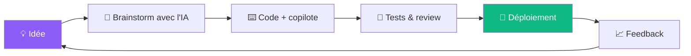

<!-- ============================================================
  README DE PROFIL — remplace USERNAME par ton pseudo GitHub
  et les [CROCHETS] par tes infos. Supprime ce commentaire.
============================================================ -->

<div align="center">


<a href="https://github.com/USERNAME">
  
</a>

<br/>


</div>

---

## 👋 `whoami`

```bash
~ $ whoami
> [TON NOM] — [TON PAYS / VILLE] 🌍

~ $ cat about.txt
> Développeur [web / data / mobile / IA] passionné par la création d'outils
> utiles. J'utilise l'IA comme copilote pour aller plus vite, apprendre
> plus profondément et livrer des projets qui comptent.
```

---

## 🧠 `profile.json` — version machine

```json
{
  "name": "[TON NOM]",
  "role": "[Ton rôle, ex: Full-Stack Developer]",
  "building": "[Ton projet principal du moment]",
  "learning": ["LLMs", "RAG", "Agents IA", "[autre techno]"],
  "workflow": "humain + IA = 10x",
  "fun_fact": "[Un truc fun sur toi]",
  "open_to": ["freelance", "collaborations", "projets open source"],
  "ask_me_about": ["[sujet 1]", "[sujet 2]", "[sujet 3]"]
}
```

---

## 🚀 En ce moment

| | |
|---|---|
| 🔭 **Je travaille sur** | [Nom du projet](https://github.com/USERNAME/projet) — [une phrase] |
| 🌱 **J'apprends** | LLMs, prompt engineering, agents IA, [autre] |
| 🤝 **Je cherche** | Des collaborateurs pour [type de projet] |
| 💬 **Demande-moi** | [sujet 1], [sujet 2] |
| ⚡ **Fun fact** | [Un truc marrant] |

---

## 🛠️ Stack

<div align="center">

**Langages**


**Frameworks & Outils**


**Data & IA**


</div>

---

## 🤖 Mon workflow avec l'IA



> 💬 *Je pense que l'IA ne remplace pas les développeurs : elle amplifie ceux qui comprennent ce qu'ils construisent.*

---

## 📌 Projets phares

<table>
  <tr>
    <td width="50%">
      <h3>🔥 <a href="https://github.com/USERNAME/projet-1">Projet 1</a></h3>
      <p>[Description en une phrase : problème résolu + impact.]</p>
      <p>
         </p>
    </td>
    <td width="50%">
      <h3>🤖 <a href="https://github.com/USERNAME/projet-2">Projet 2</a></h3>
      <p>[Description en une phrase : problème résolu + impact.]</p>
      <p>
         </p>
    </td>
  </tr>
  <tr>
    <td width="50%">
      <h3>⚡ <a href="https://github.com/USERNAME/projet-3">Projet 3</a></h3>
      <p>[Description en une phrase : problème résolu + impact.]</p>
      <p>
         </p>
    </td>
    <td width="50%">
      <h3>🧪 <a href="https://github.com/USERNAME/projet-4">Projet 4</a></h3>
      <p>[Description en une phrase : problème résolu + impact.]</p>
      <p>
         </p>
    </td>
  </tr>
</table>

---

## 📊 Stats GitHub

<div align="center">


<br/>


<br/>


</div>

---

## 🐍 Contributions

<div align="center">

<picture>
  <source media="(prefers-color-scheme: dark)" srcset="https://raw.githubusercontent.com/USERNAME/USERNAME/output/github-snake-dark.svg" />
  <source media="(prefers-color-scheme: light)" srcset="https://raw.githubusercontent.com/USERNAME/USERNAME/output/github-snake.svg" />
  
</picture>

</div>

> ℹ️ L'animation snake demande une petite GitHub Action (voir plus bas dans les instructions).

---

## 🎯 Objectifs 2026

- [x] Publier mon premier projet open source
- [ ] Construire une app propulsée par un LLM
- [ ] Contribuer à 5 projets open source
- [ ] Écrire 3 articles techniques
- [ ] Obtenir [une certification / un job / un client]

---

## 🤝 Collaborons

Je suis ouvert aux **projets IA**, aux **collaborations open source** et aux **idées un peu folles**.

<div align="center">

<a href="https://linkedin.com/in/TON-LIEN"></a>
<a href="mailto:ton@email.com"></a>
<a href="https://ton-portfolio.com"></a>
<a href="https://twitter.com/TON-PSEUDO"></a>

<br/><br/>


*⚡ Ce profil est vivant : il se met à jour tout seul.*

</div>
