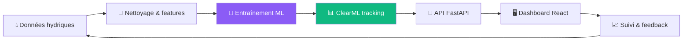

<div align="center">


<a href="https://github.com/BilalBouchroub">
  
</a>

<br/>


</div>

---

## 👋 `whoami`

```bash
~ $ whoami
> Bilal Bouchroub — El Jadida, Maroc 🇲🇦

~ $ cat about.txt
> Élève ingénieur en génie informatique et technologies émergentes à l'ENSA d'El Jadida.
> Je construis des applications full-stack, des pipelines de données et des
> plateformes MLOps. En dernière année, je cherche un PFE où l'impact est réel.

~ $ ls ./skills
> full-stack  data-engineering  mlops  cloud  devops
```

---

## 🧠 `profile.json`

```json
{
  "name": "Bilal Bouchroub",
  "school": "ENSA El Jadida (ENSAJ)",
  "role": "Élève ingénieur · Full-Stack & Data/AI",
  "status": "En recherche d'un PFE en informatique",
  "languages": ["Français (avancé)", "English (advanced)", "العربية (native)"],
  "certifications": ["AWS Cloud Foundations", "AWS Academy Cloud Developing", "Java SE 17", "C# for .NET"],
  "currently_exploring": ["MLOps", "Agents IA", "Clean Architecture", "Cloud AWS"],
  "ask_me_about": ["ASP.NET Core", "Spring Boot", "ETL & Data Warehouse", "ClearML"]
}
```

---

## 🚀 En ce moment

| | |
|---|---|
| 🎓 **Études** | Cycle ingénieur, ENSA El Jadida (2025-2026) |
| 🔭 **Je cherche** | Un **PFE** en développement, data ou IA |
| 💼 **Dernier stage** | .NET AI Developer chez **BPS Maroc** (SaaS + assistant intelligent) |
| 🌱 **J'explore** | MLOps, IA appliquée aux produits métier, cloud AWS |
| 🤝 **Ouvert à** | Collaborations, projets open source, opportunités PFE |

---

## 💼 Expérience

<table>
  <tr>
    <td width="50%">
      <h3>🏢 BPS Maroc — .NET AI Developer</h3>
      <sub>Stage · Juin-Août 2026</sub>
      <p>Développement de <b>ProductApp</b>, une plateforme SaaS en <b>Clean Architecture</b> (ASP.NET Core, C#, Entity Framework, SQL Server, React/TypeScript). Contribution à la sécurité et à l'intégration de <b>SMART PRODUCT</b>, un assistant intelligent d'analyse métier.</p>
    </td>
    <td width="50%">
      <h3>⚡ TAQA Morocco — Data Engineer</h3>
      <sub>Stage · Août-Septembre 2025</sub>
      <p>Profilage et nettoyage de données, traitements <b>ETL avec SSIS</b>, Data Warehouse, analyse <b>OLAP avec SSAS</b> et rapports interactifs <b>Power BI</b>.</p>
    </td>
  </tr>
</table>

---

## 🛠️ Stack

<div align="center">

**Langages**


**Web & Frameworks**


**Bases de données**


**Data, Big Data & IA**


**DevOps & Cloud**


</div>

---

## 🤖 Pipeline MLOps — mon projet stress hydrique

> Une plateforme web qui suit le **stress hydrique au Maroc**, avec un pipeline ML automatisé.



---

## 📌 Projets phares

<table>
  <tr>
    <td width="50%">
      <h3>💧 <a href="https://github.com/BilalBouchroub?tab=repositories">Plateforme MLOps · Stress hydrique</a></h3>
      <p>Plateforme web de suivi du stress hydrique au Maroc, avec pipelines ML automatisés via <b>ClearML</b>.</p>
      <p>
         
         </p>
    </td>
    <td width="50%">
      <h3>🛒 <a href="https://github.com/BilalBouchroub?tab=repositories">Spring E-Shop</a></h3>
      <p>E-commerce moderne : JWT, Docker, Swagger/OpenAPI et génération de factures PDF avec JasperReports.</p>
      <p>
         
         </p>
    </td>
  </tr>
  <tr>
    <td width="50%">
      <h3>📱 <a href="https://github.com/BilalBouchroub?tab=repositories">FinTrack</a></h3>
      <p>App Android de suivi financier : MVVM, Room, graphiques interactifs, sync Firebase et export PDF/CSV.</p>
      <p>
         
         </p>
    </td>
    <td width="50%">
      <h3>📝 <a href="https://github.com/BilalBouchroub?tab=repositories">Gestion des réclamations</a></h3>
      <p>Plateforme web de soumission et suivi des réclamations étudiants/enseignants, en équipe Agile Scrum.</p>
      <p>
         
         </p>
    </td>
  </tr>
</table>

---

## 📊 Stats GitHub

<div align="center">


<br/>


<br/>


</div>

---

## 🐍 Contributions

<div align="center">

<picture>
  <source media="(prefers-color-scheme: dark)" srcset="https://raw.githubusercontent.com/BilalBouchroub/BilalBouchroub/output/github-snake-dark.svg" />
  <source media="(prefers-color-scheme: light)" srcset="https://raw.githubusercontent.com/BilalBouchroub/BilalBouchroub/output/github-snake.svg" />
  
</picture>

</div>

---

## 🎯 Objectifs

- [x] Deux stages techniques (Data Engineering, .NET AI)
- [x] Certifications AWS, Java SE 17 et C#
- [ ] Décrocher un **PFE** à forte valeur ajoutée
- [ ] Construire un produit propulsé par un LLM
- [ ] Contribuer à des projets open source
- [ ] Écrire mes premiers articles techniques

---

## 🤝 Travaillons ensemble

Je cherche une équipe où appliquer mes compétences à des problèmes réels : **full-stack, data, IA et MLOps**.

<div align="center">

<a href="https://www.linkedin.com/in/TON-LIEN-LINKEDIN"></a>
<a href="mailto:bilalbouchy1365@gmail.com"></a>

<br/><br/>


*⚡ Ce profil se met à jour tout seul.*

</div>
