<div align="center">

<h3><code>bilal@github ~ $ ./contributions.sh --game</code></h3>



<br><br>

<h3><code>bilal@github ~ $ whoami</code></h3>



<br>


</div>

<br>

<h3 align="center"><code>bilal@github ~ $ cat about.txt</code></h3>

```text
Final-year software engineering student at ENSA El Jadida (ENSAJ).
I build full-stack apps, data pipelines and MLOps platforms,
and I use AI as a copilot to learn faster and ship better.
Currently looking for a PFE where I can solve real problems.
```

<h3 align="center"><code>bilal@github ~ $ ls ./projects</code></h3>

<table>
  <tr>
    <td width="50%" valign="top">
      <h4>💧 <a href="https://github.com/BilalBouchroub?tab=repositories">Water-stress MLOps platform</a></h4>
      Web platform tracking water stress in Morocco, with automated ML pipelines through <b>ClearML</b>.<br><br>
      
    </td>
    <td width="50%" valign="top">
      <h4>🛒 <a href="https://github.com/BilalBouchroub?tab=repositories">Spring E-Shop</a></h4>
      Modern e-commerce: Spring Security + JWT, Docker, Swagger/OpenAPI, PDF invoices with JasperReports.<br><br>
      
    </td>
  </tr>
  <tr>
    <td width="50%" valign="top">
      <h4>📱 <a href="https://github.com/BilalBouchroub?tab=repositories">FinTrack</a></h4>
      Android finance tracker: MVVM, Room, interactive charts, Firebase sync, PDF/CSV export.<br><br>
      
    </td>
    <td width="50%" valign="top">
      <h4>📝 <a href="https://github.com/BilalBouchroub?tab=repositories">Claims management platform</a></h4>
      Students/teachers claims platform built in an Agile Scrum team.<br><br>
      
    </td>
  </tr>
</table>

<h3 align="center"><code>bilal@github ~ $ ./stack.sh</code></h3>

<div align="center">

<br>
<br>
<br>
<br>


</div>

<h3 align="center"><code>bilal@github ~ $ ./contact.sh</code></h3>

<div align="center">

<a href="https://www.linkedin.com/in/TON-LIEN-LINKEDIN"></a>
<a href="mailto:bilalbouchy1365@gmail.com"></a>

<sub>The graph above is a game: a fighter jet burns the whole grid and leaves my name empty. My real contribution count is shown right under it.</sub>

</div>
